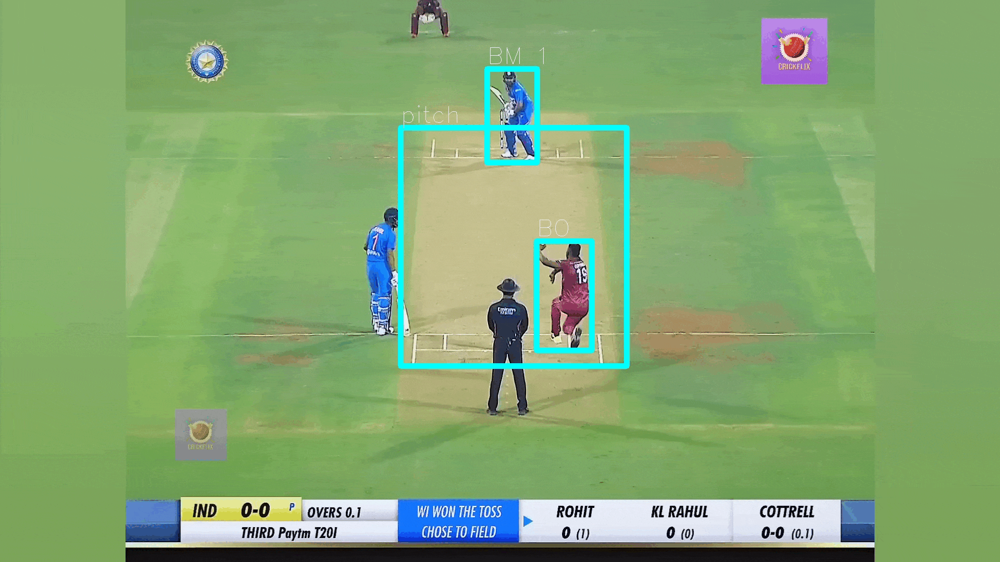
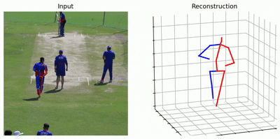
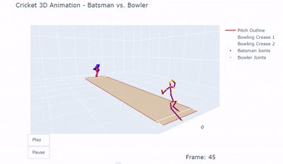

# Cricket Analytics Pipeline

A video analytics pipeline for cricket that combines rally segmentation,
player detection, pose estimation, and 3D animation to break down player
biomechanics from raw match footage.

---

## 🎬 Results
The clips below showcase the pipeline's output on sample match footage.

<table>
  <tr>
    <td align="center" colspan="2">
      <b>Player Detection</b>  
      
    </td>
  </tr>
  <tr>
    <td align="center" width="100%">
      <b>3D Animation</b>  
      
    </td>
      </tr>
  <tr>
    <td align="center" width="100%">
      <b>Simulation</b>  
      
    </td>
  </tr>
</table>

 
---
 
## ⚙️ Pipeline Overview
 
At a high level, the pipeline processes raw match video through four stages:
 
1. **Rally Segmentation** - isolates active rally footage from dead time / replays / crowd shots
2. **Player Detection** - locates and tracks the bowler and batsman across frames
3. **Pose Estimation** - extracts 2D keypoints for the tracked players
4. **3D Animation** - lifts 2D keypoints to 3D and renders an interactive animation for biomechanical analysis (e.g. bowling arm angle)
Implementation details, model architecture, and code are not included in
this repository - see the **Results** section above for output samples,
or reach out below to discuss the approach in more depth.

---

## 🤝 Let's Connect
 
If you'd like to discuss this project, potential collaborations, or
licensing - feel free to reach out.
 

  

